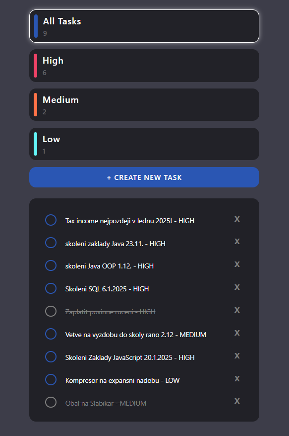
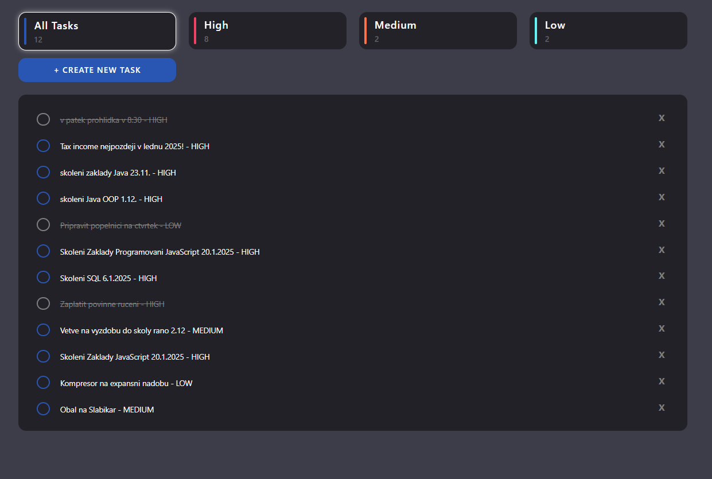

# To-Do App

## About the Project

This is my first full-stack Java Spring Boot application.
While working on this project, I used various resources and guides to understand the core concepts of backend development, frontend integration, and REST API communication.
It was a great learning experience that helped me grasp modern development practices.
Feel free to fork this project, create issues, or submit pull requests. All contributions are welcome!

## Technologies Used

- **Backend**: Spring Boot, JPA (Java Persistence API), H2 Database
- **Frontend**: HTML, CSS, Bootstrap (with custom styling)
- **JavaScript**: For frontend functionality such as task creation, completion toggle, and task deletion.
- **Responsive Design**: The application is fully responsive, with different views for mobile and desktop devices.

## Features

- Create, update, delete tasks.
- Filter tasks by priority (High, Medium, Low, and All).
- Mark tasks as completed.
- Fully responsive UI that adapts to both mobile and desktop devices.
- User-friendly interface with custom-styled buttons, checkboxes, and cards.

## Screenshots

Here are a few screenshots of the app in action:

- **Mobile View**
  
  
- **Desktop View**
  

